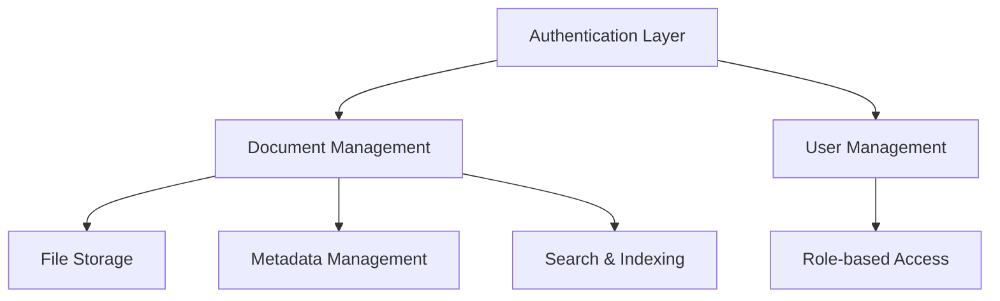

# Architecture Overview

## Tech Stack

- **Frontend Framework**: Next.js 13+ with App Router
- **Language**: TypeScript
- **Styling**: Tailwind CSS
- **UI Components**: Shadcn/ui
- **State Management**: React Context + Local Storage
- **Authentication**: Custom JWT-based auth

## System Architecture

### 1. Core Components



### 2. Data Models

#### Document
```typescript
interface Document {
  id: string
  name: string
  description: string
  type: string
  size: number
  uploadDate: string
  uploader: { id: number; name: string }
  tags: string[]
  category: string
  privacy: "public" | "private"
  folderId: string | null
  favorited: boolean
  url: string
}
```

#### Folder
```typescript
interface Folder {
  id: string
  name: string
  description: string
  createdDate: string
  createdBy: { id: number; name: string }
  parentId: string | null
}
```

#### Activity Log
```typescript
interface ActivityLog {
  id: string
  documentId: string
  userId: number
  userName: string
  action: "upload" | "download" | "view" | "edit" | "delete"
  timestamp: string
}
```

### 3. Component Architecture

The application follows a modular component architecture:

- **Pages**: Route-based components in the `app` directory
- **Features**: Self-contained feature modules in `components`
- **UI**: Reusable UI components in `components/ui`
- **Context**: Global state management in `contexts`
- **Lib**: Utilities and API functions in `lib`

### 4. State Management

1. **Authentication State**
   - Managed by AuthContext
   - JWT token storage
   - User role and permissions

2. **Document State**
   - Local storage for document metadata
   - File data handling
   - Activity tracking

3. **UI State**
   - Form states
   - Loading states
   - Error handling
   - Filter/sort preferences

### 5. Security Features

1. **Authentication**
   - JWT-based authentication
   - Secure password handling
   - Session management

2. **Authorization**
   - Role-based access control
   - Document-level privacy settings
   - Folder permissions

3. **Data Protection**
   - Client-side encryption (planned)
   - Secure file transfer
   - Privacy controls

### 6. File Management

1. **Storage**
   - Local storage (demo)
   - Cloud storage support (planned)
   - File versioning (planned)

2. **File Operations**
   - Upload/Download
   - Metadata editing
   - File preview
   - Activity logging

### 7. Search & Indexing

1. **Search Features**
   - Full-text search
   - Tag-based filtering
   - Category filtering
   - Date range filtering

2. **Indexing**
   - Document metadata indexing
   - Content indexing (planned)
   - Search optimization

## Future Enhancements

1. **Planned Features**
   - Real-time collaboration
   - Document versioning
   - Advanced permissions
   - Cloud storage integration
   - OCR and content extraction

2. **Scalability Improvements**
   - Database integration
   - Caching layer
   - API optimization
   - Bulk operations

3. **Security Enhancements**
   - Two-factor authentication
   - Advanced encryption
   - Audit logging
   - Compliance features